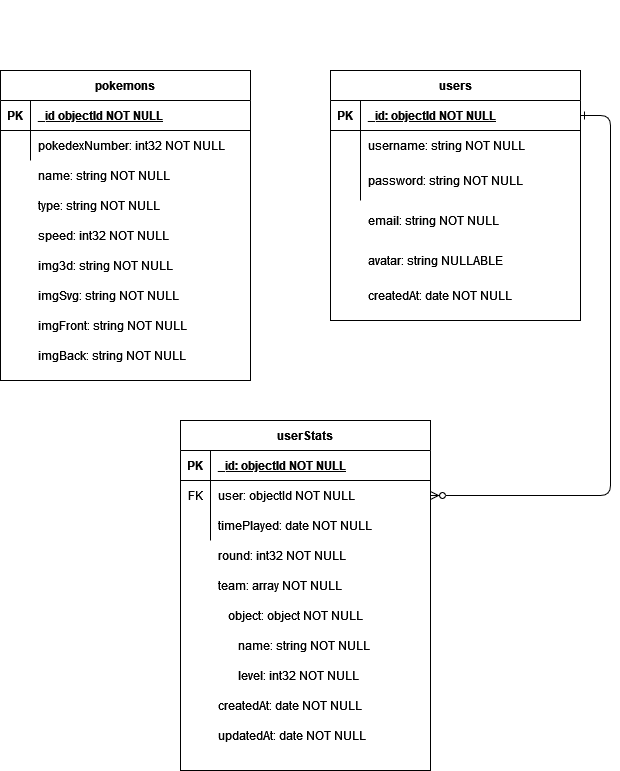
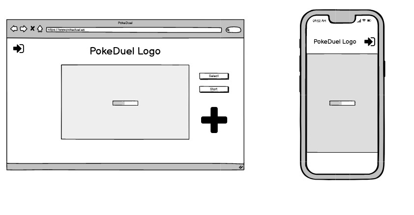
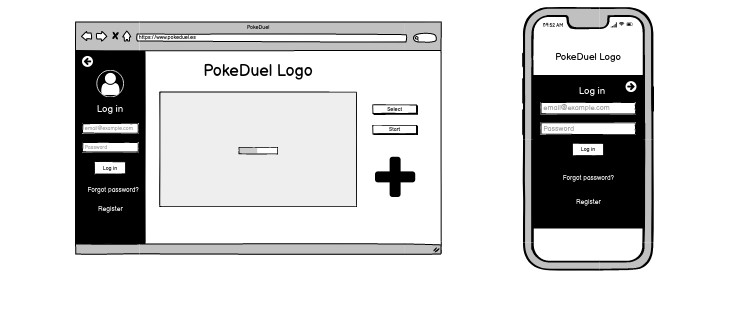
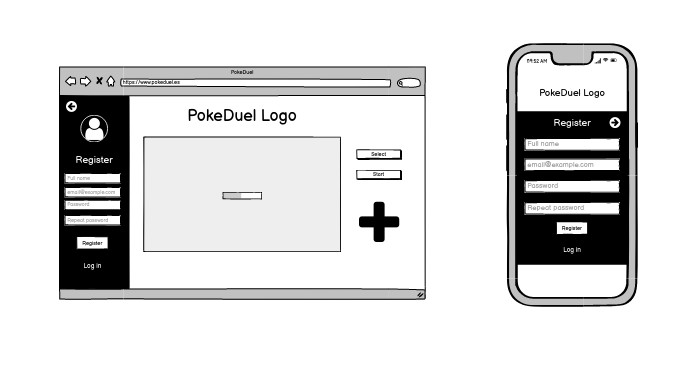
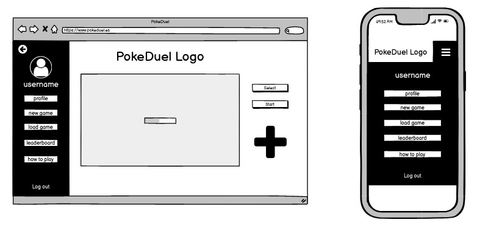
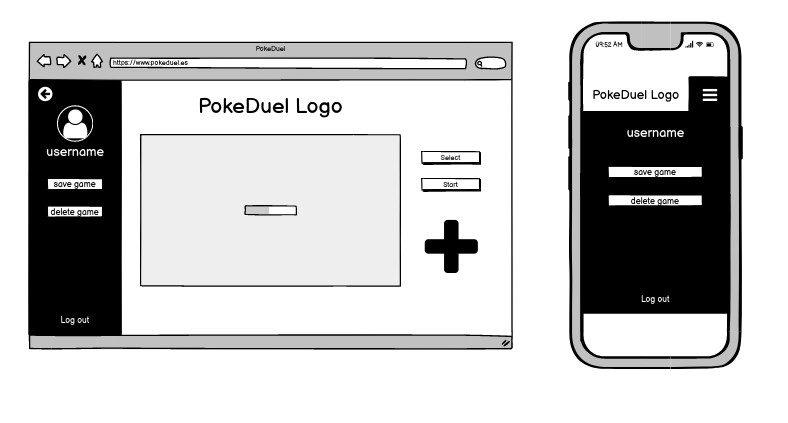
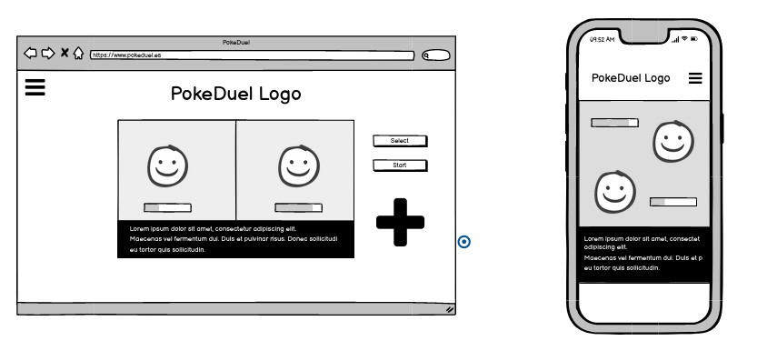
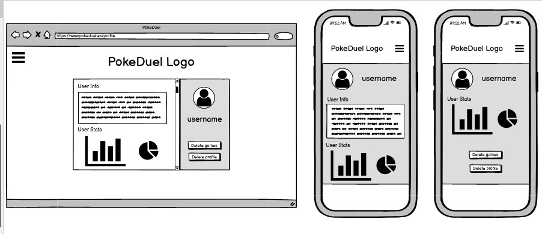

# PROYECTO FINAL DE 2º DE DAW


## Índice

A continuación se listarán los puntos del proyecto:

1. [Introducción](#introduccion)
  - [Datos del proyecto](#datos)
  - [Descripción](#descripcion)
  - [Objetivos](#objetivos)
  - [Tecnologías](#tecnologias)
2. [Desarrollo de la aplicación](#desarrollo)
  - [Análisis Previo](#analisisPrevio)
    * [Modelo de datos](#modeloDatos)
    * [Wireframe](#wireframe)
    * [Paleta de colores](#paletaDeColores)
  - [Diseño e implementación](#diseñoImplementacion)
  - [Producción](#produccion)
3. [Despliegue](#despliegue)
4. [Conclusiones del proyecto](#conclusiones)
5. [Bibliografía y webgrafía](#bibliografia)
6. [Licencia](#licencia)

## 1. Introducción<a name="introducción"></a>

#### Datos del proyecto<a name="datos"></a>

- Título del proyecto: PokeDuel
- Tutor: Antoni Amengual
- Alumnos: Kim Asiao y Santiago Martínez
- 2º de Desarrollo de Aplicaciones Web (presencial)
- 31 de mayo de 2022
- [Despliegue en Vercel](https://breakdance.github.io/breakdance/)
- [Link del proyecto](https://github.com/onikakimasiaod/pokeDuel)

#### Descripción<a name="descripcion"></a>

Esta aplicación web consiste en la creación de un juego web básico, el cual tendremos que gestionar una serie de _pokémon_ durante las batallas para conseguir pasar rondas y así obtener una determinada puntuación. 

EL usuario deberá estar registrado para poder jugar (esencial para guardar estadísticas), y requerirá, obviamente, de conexión a internet.

#### Objetivos<a name="objetivos"></a>

Las necesidades que ha de satisfacer cara al usuario recaen en que este pueda jugar sin problemas y obtener estadísticas mediante su progreso.

Por otra parte, nosotros como programadores queremos salirnos un poco de las apps típicas basadas en CRUDS simples y hacer algo más dinámico y atípico que nos suponga un, al menos, mini reto a la hora de programar.

#### Metodologías y lenguajes (teconologías)<a name="teconologias"></a>

Se han usado los siguientes lenguajes/frameworks para trabajar en este proyecto:

| Lenguaje/framework | Librerías |
| ------ | ------ |
| Angular 11 | funcionamiento por módulos (imports): fs, angular material... |
| Express | funcionamiento por módulos (require): multer, fs, aws, jwt, datefns, mongoose, dotenv... |
| SCSS | 'custom' CSS |
| Bootstrap 5 | 'custom' CSS |
| TypeScript | funcionamiento por módulos(imports) |

- Frontend: Angular 11, Bootstrap 5 y SCSS
- Backend: Node.js con Express.js, Multer (librería de gestión de ficheros) para la gestión de estos, AWS (librería que permite conectar buckets de Amazon para almacenar información) y JWT para la autenticación de usuarios
- Scrapping: se ha usado el sistema de módulos de JS (.mjs), para realizar un scrapping de datos sobre los _pokémon_ para su posterior almacenamiento en la base de datos. Para ello se ha usado la librería _fs_ para la escritura de estos sobre un .json y Node.js. 
- Metodología: scrum (sprints de desarrollo en cada ámbito entre los dos), y el uso de Trello (kanban propietario).

En el caso del frontend, hemos optado por _Ángular (JS)_ debido a que Kim se ocupa del Front y ella lo toca en la empresa, mientras que Santi está con el backend porque lo trabaja en la empresa. 

Usamos Bootstrap como framework de estilos debido a la fluidez que tenemos con él por todo lo que hemos trabajado en el curso. Además, hacemos mixins para reutilizar código.

Por otra parte, el scrapping de datos era necesario para automatizar la creación de los _pokémon_ y no tener que hacerlos a mano o con datos falsos. 

## 2. Desarrollo de la Aplicación<a name="desarrollo"></a>

### ANÁLISIS PREVIO<a name="analisisPrevio"></a>

##### MODELO DE DATOS<a name="modeloDatos"></a>

Hemos optado por un modelo de datos simple, basado en colecciones, el cual almacenará los _pokémon_, _usuarios_ y las _estadísticas_ de estos.

Los _pokémon_ solo serán para consumir los datos de la API propia levantada en servidor, mientras que en las partidas (_userStats_), se almacenarán las estadísticas del usuario y el euipo pokémon con el que haya combatido.



##### WIREFRAME<a name="wireframe"></a>
_PANTALLA DE JUEGO_:


_PANTALLA DE LOGIN_:



_PANTALLA DE REGISTRO_:



_PANTALLA DE PERFIL_:



_PANTALLA DE GUARDAR PARTIDA_:



_PANTALLA DE POKÉMON(BATALLA)_:



_PANTALLA DE ESTADÍSTICAS_:



##### PALETA DE COLORES<a name="paletaDeColores"></a>


### DISEÑO E IMPLEMENTACIÓN<a name="diseñoImplementacion"></a>

Hemos trabajado por ramas, las cuales se han ido creando por cada uno para desarrollar diferentes aspectos de la aplicación Por ejemplo si el backend está acabado, se crea una nueva rama en el caso de que se quiera añadir nuevas funcionalidades para evitar perjudicar a toda la aplicación que está en _develop o master_.

Por otra parte, la primera fase del proyecto recae en plantearnos el tipo de aplicación que queremos desarrollar. A partir de ahí, nos planetamos el modelo de datos (MongoDB), y lo implementamos en los modelos con _mongoose_ y con el modelo de controladores y rutas que tiene Express.

Es muy importante comenzar por el backend para que así luego solo se necesite conectar el front a este y comenzar a consumir datos.

Los mayores problemas que nos hemos encontrado recaen en el despliegue. No hemos podido usar Apache con Node debido a numerosos problemas con las peticiones en el lado del servidor; con Nginx no hemos podido hacer funcionar del todo la aplicación. Por lo tanto, hemos decidido desplegar el backend en _railway.app_(basado en _Heroku_), y en _Vercel_ en el lado cliente.

### PRODUCCIÓN<a name="produccion"></a>
INSERTAR CAPTURAS DEL FRONT Y EXPLICAR BREVE AQUÍ!!

## 3. DESPLIEGUE<a name="despliegue"></a>

```sh
Backend: https://pokeduel-dev-multer.up.railway.app/ (API REST)
Frontend: https://client-five-xi.vercel.app/
```

En un principio, el despliegue estaba pensado para AWS y sus máquinas EC2 con 750h gratuítas al mes, pero Node 'no se lleva' especialmente bien con Apache y tuvimos diversos problemas con el servidor (errores 503 por sobrecarga de peticiones), por lo que, tras perder mucho tiempo con esto, decidimos irnos a despliegues más 'sencillos' en _Railway_ y _Vercel_.

El despliegue se ha dividido en dos partes: la del servidor y la del cliente.

En el caso del servidor, hemos usado _railway_, basado en _Heroku_, la cual nos permite hacer un fácil desplegue importando nuestras variables de entorno (.env), directamente al despliegue. Además, te proporciona logs del despliegue, de peticiones y de errores, útil para cuando falla.

En el lado cliente hemos usado _Vercel_ debido a la fácil integración con Angular, además de proporcionarte un enlace público y colocártelo automáticamente en el repositorio de la aplicación en GitHub.

| Front/Back | Despliegue |
| ------ | ------ |
| Front | Vercel/Netlify |
| Back | Railway.app |
| Amazon Web Services | 'buckets' que almacenan ficheros (S3) |


Ambos despliegues necesitan las variables de entorno declaradas en local para poder funcionar, y más cuando tenemos que consumir una API REST.

### 4. RESULTADOS Y CONCLUSIONES<a name="conclusiones"></a>

Los objetivos marcados inicialmente no se han consolidado debido a que tuvimos problemas con una persona del grupo que no hizo absolutamente nada. 

Este proyecto era y es ambicioso porque nos salimos de lo convencional para aplicar lo aprendido y trabajar con entornos 'hostiles' para readaptarnos a nuevas experiencias y desafíos. Pero todo esto se ha visto 'torpedeado' por una persona y el proyecto en esencia se ha hecho con prisas y sin la motivación suficiente.

Como se ha mencionado con anterioridad, el proyecto iba a ser algo que conllevara un trabajo intenso pero bien repartido entre los tres, pero debido a los problemas ya mencionados, nos hemos visto obligados a simplificarlo mucho para poder acabarlo a tiempo.

La esencia de la idea inicial se manetiene, pero con muchos cambios no deseados por falta de tiempo y problemas ya mencionados.

Para finalizar, si nos viéramos con ganas de seguir con este proyecto, implementaríamos nuevos pokémon, tipos, ránkings, más opciones de batalla y una interfaz algo más trabajada. Y quizás, y solo quizás, nos pensaríamos en sacar una versión de escritorio usando _Electron.js_.

### 5. Bibliografía y Webgrafía<a name="bibliografia"></a>

Gran parte de la bibliografía y webgrafía se encuentra en el siguiente enlace. Además, esta documentación ha sido creada por Santiago en relación al backend de la aplicación.

[Backend con mongoose, Express y JWT (autor: Santiago Martínez)](https://docs.google.com/document/d/12O9TEtMsQjA9WDDlTKtHU0nl27Jt9BUjFu3dCzjWbwk/edit?usp=sharing)

La parte del frontend se ha creado por Kim y se ha desarrollado en Angular con el framework de desarrollo _Angular CLI_.


[Documentación de Angular CLI](https://angular.io/docs)

La parte de los buckets de Amazon Web Services se ha creado recae en la documentación de [AWS](https://aws.amazon.com/es/developer/), y se ha desarrollado con las librerías de desarrollo _AWS (Express.js)_.


### 6. Licencia<a name="licencia"></a>

<a rel="license" href="http://creativecommons.org/licenses/by-nd/4.0/"></a><br />Este obra está bajo una <a rel="license" href="http://creativecommons.org/licenses/by-nd/4.0/">licencia de Creative Commons Reconocimiento-SinObraDerivada 4.0 Internacional</a>. por Kim Asiao y Santiago Martínez

